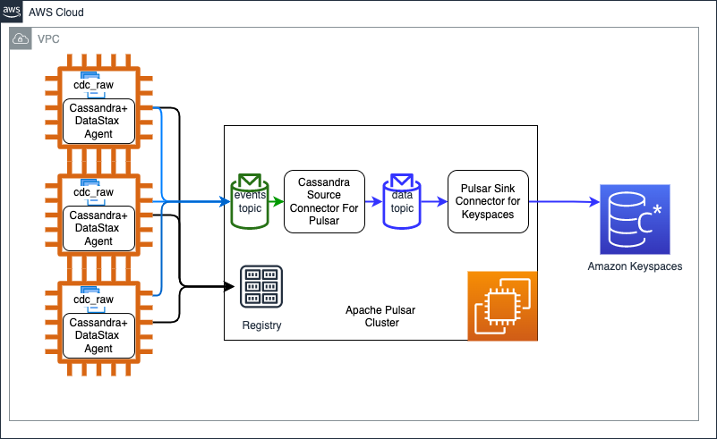
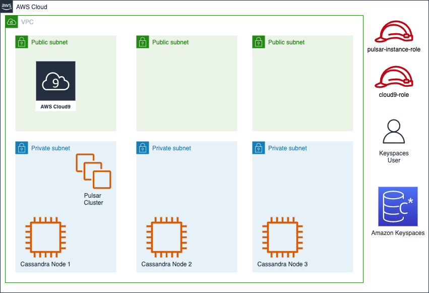
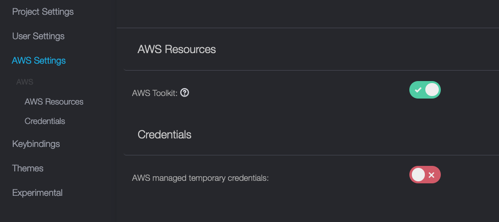

## Overview
Change Data Capture (CDC) determines and tracks changes on source Cassandra tables and pushes those changes to a message buffer in chronological order. In this document we use [DataStax CDC for Apache Cassandra](https://github.com/datastax/cdc-apache-cassandra) to track changes in Cassandra database and push those changes to an Apache Pulsar cluster. We then use a Apache Pulsar sink connector to replicate those changes to Amazon Keyspaces database. The approach can be used to do a live migration on Apache Cassandra database to Amazon Keyspaces database. 
In this document we narrate end to end process to do live migration of Cassandra to Keyspaces. Use following steps for end to end live migration of Apache Cassandra to Amazon Keyspaces databse –
* Deploy Apache Cassandra 4 if you don’t have Cassandra deployment and are looking to do a POC on this solution. Enable CDC on each node of the cluster. Refer [Enabling Cassandra CDC](https://debezium.io/documentation/reference/stable/connectors/cassandra.html#setting-up-cassandra) to enable CDC. 
* Deploy Apache Pulsar cluster on EC2 nodes.
* Deploy DataStax change agent to Apache Cassandra cluster and enable capture of CDC. This process will start pushing changes from Cassandra to events-<keyspace-name>.<table-name> topic on Apache Pulsar.
* Deploy Datastax Source connector for Apache Pulsar which consumes events-<keyspace-name>.<table-name> topic and pushes changed data to data-<keyspace-name>.<table-name> topic.
* Migrate Apache Cassandra to Keyspaces. This will migrate current state of Cassandra to Keyspaces while the change to Cassandra are being pushed to data-<keyspace-name>.<table-name> topic.  
* Validate data once migration is complete.
* Deploy Pulsar sink connector for Keyspaces database. The connector will start pushing changes captured on data-<keyspace-name>.<table-name> topic to Keyspaces database.
* Validate correctness of data in Keyspace and ensure that changes in Cassandra are being replicated.
* Deploy new version of application to start reading/writing from/to Keyspaces database.  

## Architecture


## Deployment Architecture


## Deployment pre-requisite
### Cassandra Deployment
1. If you don't have Cassandra deployment and want to do POC on this approach , use the instructions below to deploy Apache Cassandra 4 and enable CDC.
    follow steps below to deploy Cassandra. 
2. For Apache Cassandra deployment we are following this [link](https://aws-quickstart.github.io/quickstart-datastax-oss/).
3. Refer to the [overview](https://aws-quickstart.github.io/quickstart-datastax-oss/#_overview) and ensure that the deployment is supported in your region.
4. Use quick start [link](https://aws-quickstart.github.io/quickstart-datastax-oss/#_launch_the_quick_start) to launch Cassandra 4 cluster into an existing VPC or a new VPC.
   1. **Create the cluster in such that the nodes are created without Public IP**. (CreateClusterWithPublicIP=false)
### Prepare Cloud9 workspace   
1. Create a Cloud9 instance in the public subnet of the VPC which hosts Cassandra cluster. Upload SSH keys to Cloud9 and change permission to 400. 
2. Validate Cassandra deployment by connecting to a node of the cluster and executing `nodetool status`

```
   export CASSANDRA_KEY_FILE=<path-key-file>
   ssh -i ${CASSANDRA_KEY_FILE} ubuntu@<CASSANDRA_NODE_PRIVATE_IP> "nodetool status" 
``` 


3. Create an IAM role for EC2 and add arn:aws:iam::aws:policy/AmazonEC2FullAccess, arn:aws:iam::aws:policy/SecretsManagerReadWrite , arn:aws:iam::aws:policy/IAMFullAccess and arn:aws:iam::aws:policy/AmazonSSMManagedInstanceCore roles. Assign the role to EC2 instance of Cloud9. Go to Settings -> AWS Settings and disable "AWS managed temporary credentials".  Validate the role by executing following commands - 
```

aws sts get-caller-identity

```


4. Install ansible, jq, Java 8 and Maven 3.1+.
```
sudo yum install jq ; pip install ansible
terraform version

```
```
sudo yum -y update
sudo yum -y install java-1.8.0-openjdk-devel
sudo update-alternatives --config java
sudo update-alternatives --config javac
```
```
sudo wget http://repos.fedorapeople.org/repos/dchen/apache-maven/epel-apache-maven.repo -O /etc/yum.repos.d/epel-apache-maven.repo
sudo sed -i s/\$releasever/6/g /etc/yum.repos.d/epel-apache-maven.repo
sudo yum install -y apache-maven
```
### Setup deployment code
1. Clone GitHub repository and set environment variables.
```shell
git clone https://github.com/akshayar/cassandra-to-keyspaces-replication.git
cd  cassandra-to-keyspaces-replication 
export SOURCE_CODE_ROOT=`pwd`
## For multi node pulsar cluster go to pulsar-cluster/terraform-ansible-mnode/aws 
## For single node/standalone pulsar go to 
## cd terraform-ansible-standalone/aws
cd terraform-ansible-mnode/aws
export AWS_DEPLOYMENT_HOME=`pwd`
. ${SOURCE_CODE_ROOT}/setup-repository.sh

```
2. Update `${SOURCE_CODE_ROOT}/setup-environment.sh` and `${SOURCE_CODE_ROOT}/parameters/cassandra-config-template.json`. Run below command to set environment variables. 
```
. ${SOURCE_CODE_ROOT}/setup-environment.sh
```
3. Update `${AWS_DEPLOYMENT_HOME}/cassandra.ini` and add all Cassandra servers in the cassandra.ini file. 
### Enable Cassandra CDC , modify to enable connect with private IP and create source schema for POC
1. Enable CDC by modifying <CASSANDRA_ROOT>/conf/cassandra.yaml (/usr/share/oss/conf/cassandra.yaml for deployment in Step 1) and adding/updating following properties.
```shell
cdc_enabled: false
cdc_total_space_in_mb: 4096
cdc_free_space_check_interval_ms: 250
cdc_raw_directory: /var/lib/cassandra/cdc_raw
```
2. Run following ansible commands to enable CDC and copy [schema.cql](./cassandra-templates/schema.cql).

```shell
cd ${AWS_DEPLOYMENT_HOME}
ansible-playbook   --user='ubuntu'   --inventory=cassandra.ini --extra-vars='{"ansible_ssh_private_key_file":"'${CASSANDRA_KEY_FILE}'", "cassandra_config_file_path":"'${CASSANDRA_CONFIG_FILE_PATH}'"}'  ../cassandra-cluster-enable-cdc.yaml
```
3. Execute following command to create required keyspace and table from [schema.cql](./cassandra-templates/schema.cql). 

```
CASSANDRA_SEED_SERVER_1=`echo ${CASSANDRA_SEED_SERVERS} | cut -f1 -d","`
ssh -i ${CASSANDRA_KEY_FILE} ubuntu@${CASSANDRA_SEED_SERVER_1} 
## Execute following command to create schema
cqlsh `hostname` -f schema.sql
```
### Setup Keystore for Connection to Amazon Keyspaces
1. Create truststore.

   ```shell
    cd ${AWS_DEPLOYMENT_HOME}
    mkdir ../keystore ; cd ../keystore
    curl https://certs.secureserver.net/repository/sf-class2-root.crt -O
    openssl x509 -outform der -in sf-class2-root.crt -out temp_file.der
    keytool -import -alias cassandra -keystore cassandra_truststore.jks -file temp_file.der
    
    mkdir -p ~/keystore
    cp cassandra_truststore.jks ~/keystore
    
   ```   
## Deploy Apache Pulsar cluster
1. Use these steps to deploy Apache Pulsar cluster on EC2 nodes. The instructions below refer code and instructions from [Deploying a Pulsar cluster on AWS using Terraform and Ansible]
(https://pulsar.apache.org/docs/deploy-aws/). We customized the code and instructions for the scope of this document.
2. You will use Terraform and Ansible to deploy the cluster. You will use Cloud9 instance to execute the steps mentioned below. You need to create the Cloud9 workspace in a public subnet of the target VPC. The VPC could be the VPC of Aapche Cassandra or a VPC that has a peering connection with VPC of Apache Cassandra.

3. Install Terraform Inventory tool which will create ansible inventory from terraform deployment.
```shell
cd $HOME/environment
wget https://github.com/adammck/terraform-inventory/releases/download/v0.10/terraform-inventory_v0.10_linux_amd64.zip
unzip terraform-inventory_v0.10_linux_amd64.zip 
chmod +x terraform-inventory
export PATH=$PATH:./
```
4. Create ssh keys
```shell
ssh-keygen -t rsa  

ls ~/.ssh
```
5. Get subnet and VPC details of Cloud9 instance.
```shell
INSTANCE_ID=`wget -q -O - http://169.254.169.254/latest/meta-data/instance-id`
echo ${INSTANCE_ID}
SECURITY_GROUP_ID=`aws ec2 describe-instance-attribute --instance-id $INSTANCE_ID --attribute groupSet --query Groups[0].GroupId --output text`
VPC_ID=`aws ec2 describe-instances   --instance-ids ${INSTANCE_ID} --query Reservations[0].Instances[0].VpcId --output text`
aws ec2 describe-instances   --instance-ids ${INSTANCE_ID} --query Reservations[0].Instances[0].[PublicDnsName,PublicIpAddress,PrivateDnsName,PrivateIpAddress,SubnetId,VpcId] --output text
aws ec2 describe-vpcs  --vpc-ids ${VPC_ID} --query Vpcs[0].CidrBlock --output text
aws ec2 describe-subnets --filters "Name=vpc-id,Values=${VPC_ID}" --query Subnets[].[VpcId,AvailabilityZone,CidrBlock,SubnetId,AvailableIpAddressCount,Tags[].Value] --output text 
```

6. You needd to create Pulsar nodes in the private subnet of the VPC of Cassandra cluster. Edit terraform.tfvars file and update region,VpcID, availability_zone , subnet_id and base_cidr_block.
7. Execute following command to create EC2 instnaces required to host Apache Pulsar. The deployment steps will promopt-"Do you want to perform these actions?". Enter yes.
```shell
cd ${AWS_DEPLOYMENT_HOME}
terraform init
terraform apply
```
8. Set environment variables which will be used to connect to Pulsar cluster in following commands.

```
export PULSAR_SERVICE_VALUE=`cat terraform.tfstate | jq -r .outputs.pulsar_service_url.value` 
echo $PULSAR_SERVICE_VALUE 
export PULSAR_ADMIN_URL=`cat terraform.tfstate | jq -r .outputs.pulsar_web_url.value` 
echo $PULSAR_ADMIN_URL
```

9. Run the ansible playbook to deploy Apache Pulsar on EC2 instances created above.
```shell
cd ${AWS_DEPLOYMENT_HOME}
TF_STATE=./ TF_KEY_NAME=private_ip ansible-playbook   --user='ec2-user'   --inventory=~/environment/terraform-inventory  ../pulsar-cluster-deploy.yaml
```
10. Validate Apache Pulsar cluster  installation. The steps above will install Apache Pulsar libraries on Cloud9 node at ~/environment/pulsar-client. Validate cluster deployment by sending and consuming messages.
```shell
mkdir ~/environment/pulsar-client
cd ~/environment/pulsar-client
bin/pulsar-client --url $PULSAR_SERVICE_VALUE  consume test-topic -s "first-subscription" &

bin/pulsar-client --url $PULSAR_SERVICE_VALUE  produce test-topic --messages "hello-pulsar" > test-produce.log

```

## Deploy Datastax change agent to Apache Cassandra cluster
1. Use these steps to deploy and start Datastax change agent to Apache Cassandra cluster. 
2. Deploy DataStax change agent for Apache Cassandra and enable capture of CDC. This process will start pushing changes from Cassandra to events-<source-keyspace-name>.<source-table-name> topic on Apache Pulsar.
3. Run following commands to install DataStax agent and restart Cassandra service -
```shell
cd ${AWS_DEPLOYMENT_HOME}
ansible-playbook   --user='ubuntu'   --inventory=cassandra.ini --extra-vars='{"ansible_ssh_private_key_file":"'${CASSANDRA_KEY_FILE}'","pulsar_service_url":"'${PULSAR_SERVICE_VALUE}'"}'  ../cassandra-cluster-update-cdc-agent.yaml
```

## Deploy Datastax Source connector for Apache Pulsar 
1. Use these steps to deploy Datastax source connectoer for Apache Pulsar which pushes Cassandra changes to Apache Pulsar cluster. 
2. Deploy Datastax Source connector for Apache Pulsar which consumes events-<source-keyspace-name>.<source-table-name> topic and pushes changed data to data-<source-keyspace-name>.<source-table-name> topic.
3. Check if event topic is created and Cassandra is pushing events to it. The event topic name should look like - "persistent://public/default/events-<source-keyspace-name>.<source-table-name>"

```
cd ~/environment/pulsar-client
bin/pulsar-admin --admin-url $PULSAR_ADMIN_URL  topics list public/default

```
4. Run following commands to deploy Datastax source connector for Apache Pulsar -
```shell
cd ${AWS_DEPLOYMENT_HOME}
TF_STATE=./ TF_KEY_NAME=private_ip  ansible-playbook   --user='ec2-user' --inventory=~/environment/terraform-inventory --extra-vars="@../parameters/cassandra-config.json"  ../cassandra-source-connector-deploy.yaml

TF_STATE=./ TF_KEY_NAME=private_ip  ansible-playbook   --user='ec2-user' --inventory=~/environment/terraform-inventory --extra-vars="@../parameters/cassandra-config.json"  ../cassandra-source-connector-create.yaml

```
5. Check if data topic is created.
```
cd ~/environment/pulsar-client
bin/pulsar-admin --admin-url $PULSAR_ADMIN_URL  topics list public/default

```
6. If the data topic is not created , update source table in Cassandra with an insert query.

7. Use following commands to consume event topic for customer table to ensure that Cassandra us pushing CDC events to events topic. During the process make and insert or update in the source Cassandra table.
```
bin/pulsar-client --url $PULSAR_SERVICE_VALUE  consume events-${SOURCE_KEYSPACE}.${SOURCE_TABLE_NAME} -s "first-subscription" 

```
8. Use following commands to consume data topic for customer table to ensure that DataStax CDC source connector is pushing CDC data to data topic. During the process make and insert or update in the source Cassandra table.
```
bin/pulsar-client --url $PULSAR_SERVICE_VALUE  consume data-${SOURCE_KEYSPACE}.${SOURCE_TABLE_NAME} -s "first-subscription" 
```
## Migrate Apache Cassandra to Amazon Keyspaces
1. Use these steps for one time migration of Cassandra to Amazon Keyspaces while the live replication to Apache Pulsar is in progress. During the course of this migration changes are being replicated to Apache Pulsar, there is strong probability of those changes to migrate to Amazon Keysapces databse using the one time migration approach as well. You need to ensure that Pulsar sink connector for Amazon Keyspaces database idempotent. 
2. Refer [Cassandra to Amazon Keyspace Offline migration](https://docs.aws.amazon.com/keyspaces/latest/devguide/migrating.html).
3. For this demo we will be using [Using Bulkload](https://docs.aws.amazon.com/keyspaces/latest/devguide/dsbulk-upload.html).

4. Prepare Keyspaces database. From Cloud9 workspace run following commands.
    1. Create target keyspace and table.
    ```shell
      aws keyspaces create-keyspace --keyspace-name <keyspace-name>
    ```
    2. Create tables in the keyspace from [keyspaces-schema.cql](./cassandra-templates/keyspaces-schema.cql)
    3. Generate service specific credentials. Refer [Keyspaces Credential Generation](https://docs.aws.amazon.com/keyspaces/latest/devguide/programmatic.credentials.ssc.html) .
    ```shell
    USER_NAME=keyspace-user
    aws iam create-user --user-name ${USER_NAME}
    
    aws iam attach-user-policy --policy-arn arn:aws:iam::aws:policy/AmazonKeyspacesFullAccess --user-name ${USER_NAME}
   
    SECRET_STRING=`aws iam create-service-specific-credential \
    --user-name ${USER_NAME} \
    --service-name cassandra.amazonaws.com --query ServiceSpecificCredential`
    export SERVICE_USER_NAME=`echo $SECRET_STRING | jq -r  .ServiceUserName`
    export SERVICE_USER_PASSWORD=`echo $SECRET_STRING | jq -r  .ServicePassword`
   
    mkdir -p ~/environment/cassandra-bulk
       
    envsubst < ${SOURCE_CODE_ROOT}/cassandra-templates/keyspaces-connector.conf > ~/environment/cassandra-bulk/keyspaces-connector.conf 
    ```
    4. Create secret in AWS Secret Manager.
    ```shell
     aws secretsmanager create-secret \
        --name keyspace-secret1 --region ${REGION} \
        --description "Keyspace Secret for Keyspace Sink Connector." \
        --secret-string "{\"ServiceUserName\":\"$SERVICE_USER_NAME\",\"ServicePassword\":\"${SERVICE_USER_PASSWORD}\"}"
    ```
    4. Update IAM permissions of the use created above to write to Amazon Keyspaces table. You can add arn:aws:iam::aws:policy/AmazonKeyspacesFullAccess policy for the POC or a customized on for narrower permission.

5. From Cloud9 execute following commands to install dsbulk.
```
curl -OL https://downloads.datastax.com/dsbulk/dsbulk-1.8.0.tar.gz
tar -zxvf dsbulk-1.8.0.tar.gz
export PATH=$PATH:./dsbulk-1.8.0/bin
```
6. Execute following command to create CSV file for the table you are migrating.
   ```
   . ${SOURCE_CODE_ROOT}/setup-environment.sh
   CASSANDRA_SEED_SERVER_1=`echo ${CASSANDRA_SEED_SERVERS} | cut -f1 -d","`
   ```
   ```
   mkdir -p ~/environment/cassandra-bulk
   cd ~/environment/cassandra-bulk
   envsubst < ${SOURCE_CODE_ROOT}/cassandra-templates/cassandra-bulk-load-template.conf > cassandra-bulk-load.conf 
   dsbulk unload -k ${SOURCE_KEYSPACE} -t ${SOURCE_TABLE_NAME} -f ./cassandra-bulk-load.conf > keyspaces_sample_table.csv
   ```
7. Follow steps in [Data Preparation](https://docs.aws.amazon.com/keyspaces/latest/devguide/dsbulk-upload-prepare-data.html) to prepare and analyze the data.
   ```
   tail -n +2 keyspaces_sample_table.csv | shuf -o keyspace.table.csv && (head -1 keyspaces_sample_table.csv && cat keyspace.table.csv ) > keyspace.table.csv1 && mv keyspace.table.csv1 keyspace.table.csv
   ```
   ```
   awk -F, 'BEGIN {samp=10000;max=-1;}{if(NR>1){len=length($0);t+=len;avg=t/NR;max=(len>max ? len : max)}}NR==samp{exit}END{printf("{lines: %d, average: %d bytes, max: %d bytes}\n",NR,avg,max);}' keyspace.table.csv
   ```
8. Set throughput for Keyspaces table. Refer [Setting Keyspaces throughput](https://docs.aws.amazon.com/keyspaces/latest/devguide/dsbulk-upload-capacity.html)
9. Execute following commands to load data to Keyspaces.
```
cp ${AWS_DEPLOYMENT_HOME}/../keystore/cassandra_truststore.jks .
dsbulk load -f ./keyspaces-connector.conf  --connector.csv.url keyspace.table.csv -header true --batch.mode DISABLED --executor.maxPerSecond 5 --driver.basic.request.timeout "5 minutes" --driver.advanced.retry-policy.max-retries 10 -k ${TARGET_KEYSPACE} -t ${TARGET_TABLE}
```

## Validate data once migration is complete

## Deploy Pulsar sink connector for Amazon Keyspaces database
1. Once the one time migration is complete use these steps to deploy and start Pulsar sink connector for Amazon Keyspaces database which will push the changes buffered in Apache Pulsar cluster to Amazon Keyspaces databse. The sink connector should be idempotent as there is strong probability that some of these changes are already migrated to Amazon Keyspaces through one time migration. 
2. Deploy Pulsar sink connector for Keyspaces database. The connector will start pushing changes captured on data-<keyspace-name>.<table-name> topic to Keyspaces database.
3. Build ţhe package and copy nar file to ${AWS_DEPLOYMENT_HOME}/binaries.

```shell
cd ${SOURCE_CODE_ROOT}/cassandra-cdc/datastax-cdc-pulsar/pulsar-io-cassandra-sink
./build.sh 
mkdir -p ${AWS_DEPLOYMENT_HOME}/../binaries
cp target/pulsar-io-cassandra-sink-*.nar ${AWS_DEPLOYMENT_HOME}/../binaries
```

4. Deploy Keyspace Sink Connector.
    1. Run following commands to deploy Keyspace Sink Connector.
   ```shell
    cd ${AWS_DEPLOYMENT_HOME}
    TF_STATE=./ TF_KEY_NAME=private_ip  ansible-playbook   --user='ec2-user' --inventory=~/environment/terraform-inventory --extra-vars="@../parameters/cassandra-config.json"  ../keyspace-sink-connector-deploy.yaml
   ```
    2. Run following command to start  Keyspace Sink Connector.
   ```shell
    cd ${AWS_DEPLOYMENT_HOME}
    TF_STATE=./ TF_KEY_NAME=private_ip  ansible-playbook   --user='ec2-user' --inventory=~/environment/terraform-inventory --extra-vars="@../parameters/cassandra-config.json"  ../keyspace-sink-connector-create.yaml
   ```
    3. Run following command to check status of Keyspace Sink Connector.
   ```shell
    cd ${AWS_DEPLOYMENT_HOME}
    TF_STATE=./ TF_KEY_NAME=private_ip  ansible-playbook   --user='ec2-user' --inventory=~/environment/terraform-inventory --extra-vars="@../parameters/cassandra-config.json"  ../keyspace-sink-connector-check-status.yaml
   ```


## Validate correctness of data in Amazon Keyspaces database
