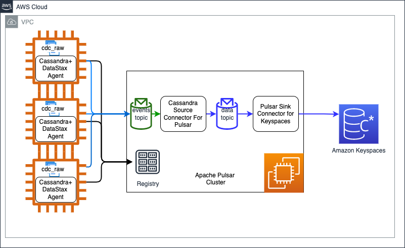
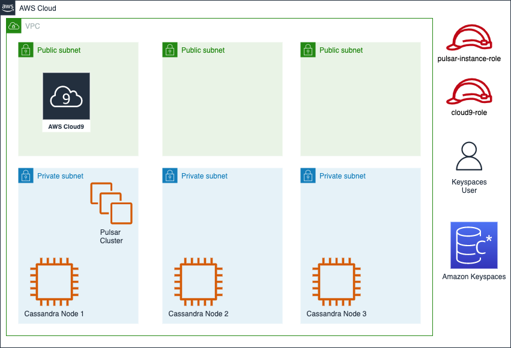
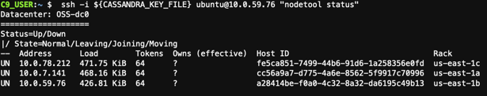
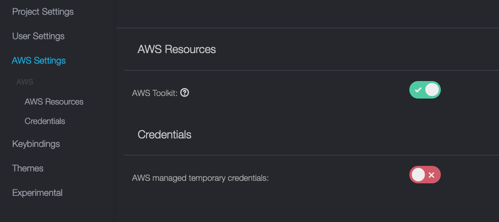

## Overview
Change Data Capture (CDC) determines and tracks changes on source Cassandra tables and pushes those changes to a message buffer in chronological order. In this document we use [DataStax CDC for Apache Cassandra](https://github.com/datastax/cdc-apache-cassandra) to track changes in Cassandra database and push those changes to an Apache Pulsar cluster. We then use a Apache Pulsar sink connector to replicate those changes to Amazon Keyspaces database. The approach can be used to do a live migration on Apache Cassandra database to Amazon Keyspaces database. 
In this document we narrate end to end process to do live migration of Cassandra to Keyspaces. Use following steps for end to end live migration of Apache Cassandra to Amazon Keyspaces databse –
* Deploy Apache Cassandra 4 if you don’t have Cassandra deployment and are looking to do a POC on this solution. Enable CDC on each node of the cluster. Refer [Enabling Cassandra CDC](https://debezium.io/documentation/reference/stable/connectors/cassandra.html#setting-up-cassandra) to enable CDC. 
* Deploy Apache Pulsar cluster on EC2 nodes.
* Deploy DataStax change agent to Apache Cassandra cluster and enable capture of CDC. This process will start pushing changes from Cassandra to events-<keyspace-name>.<table-name> topic on Apache Pulsar.
* Deploy Datastax Source connector for Apache Pulsar which consumes events-<keyspace-name>.<table-name> topic and pushes changed data to data-<keyspace-name>.<table-name> topic.
* Migrate Apache Cassandra to Keyspaces. This will migrate current state of Cassandra to Keyspaces while the change to Cassandra are being pushed to data-<keyspace-name>.<table-name> topic.  
* Validate data once migration is complete.
* Deploy Pulsar sink connector for Keyspaces database. The connector will start pushing changes captured on data-<keyspace-name>.<table-name> topic to Keyspaces database.
* Validate correctness of data in Keyspace and ensure that changes in Cassandra are being replicated.
* Deploy new version of application to start reading/writing from/to Keyspaces database.  

## Architecture


## Deployment Architecture


## Deployment pre-requisite
1. **Cassandra Deployment** - If you don't have Cassandra deployment and want to do POC on this approach , use the instructions below to deploy Apache Cassandra 4 and enable CDC.
    * [Deploy Apache Cassandra](cassandra4-deployment.md)
2. Create a Cloud9 instance in the public subnet of the VPC which hosts Cassandra cluster. Upload SSH keys to Cloud9 and change permission to 400. 
3. Validate Cassandra deployment by connecting to a node of the cluster and executing `nodetool status`

```shell
   export CASSANDRA_KEY_FILE=<path-key-file>
   ssh -i ${CASSANDRA_KEY_FILE} ubuntu@<CASSANDRA_NODE_PRIVATE_IP> "nodetool status" 
``` 


4. Create an IAM role for EC2 and add arn:aws:iam::aws:policy/AmazonEC2FullAccess, arn:aws:iam::aws:policy/SecretsManagerReadWrite , arn:aws:iam::aws:policy/IAMFullAccess and arn:aws:iam::aws:policy/AmazonSSMManagedInstanceCore roles. Assign the role to EC2 instance of Cloud9. Go to Settings -> AWS Settings and disable "AWS managed temporary credentials".  Validate the role by executing following commands - 
```shell
aws sts get-caller-identity
```


5. Install ansible, jq, Java 8 and Maven 3.1+.
```shell
sudo yum install jq ; pip install ansible
terraform version

```
```shell
sudo yum -y update
sudo yum -y install java-1.8.0-openjdk-devel
sudo update-alternatives --config java
sudo update-alternatives --config javac
```
```shell
sudo wget http://repos.fedorapeople.org/repos/dchen/apache-maven/epel-apache-maven.repo -O /etc/yum.repos.d/epel-apache-maven.repo
sudo sed -i s/\$releasever/6/g /etc/yum.repos.d/epel-apache-maven.repo
sudo yum install -y apache-maven
```

6. Clone GitHub repository and set environment variables.
```shell
git clone https://github.com/akshayar/cassandra-to-keyspaces-replication.git
cd  cassandra-to-keyspaces-replication 
export SOURCE_CODE_ROOT=`pwd`
## For multi node pulsar cluster go to pulsar-cluster/terraform-ansible-mnode/aws 
## For single node/standalone pulsar go to 
## cd terraform-ansible-standalone/aws
cd terraform-ansible-mnode/aws
export AWS_DEPLOYMENT_HOME=`pwd`
. ${SOURCE_CODE_ROOT}/setup-repository.sh

```
7. Update `${SOURCE_CODE_ROOT}/setup-environment.sh` and `${SOURCE_CODE_ROOT}/parameters/cassandra-config-template.json`. Run below command to set environment variables. 
```shell
. ${SOURCE_CODE_ROOT}/setup-environment.sh
```
8. Start a process to insert fake data into the source Cassandra table to simulate a running application.

```shell

cd ${SOURCE_CODE_ROOT}/cassandra-java-samples
./build.sh
## Delay in MS
export DELAY=10
## Count of data
export COUNT=100000
cat << EOF > cassandra-source.conf
datastax-java-driver {
  basic.contact-points = [ "${CASSANDRA_SEED_SERVER_1}"]
}
EOF
./fake-crud.sh cassandra-source.conf ${SOURCE_KEYSPACE}

```
9. Update `${AWS_DEPLOYMENT_HOME}/cassandra.ini` and add all Cassandra servers in the cassandra.ini file. 

10. Enable CDC by modifying <CASSANDRA_ROOT>/conf/cassandra.yaml (/usr/share/oss/conf/cassandra.yaml for deployment in Step 1) and adding/updating following properties.
```shell
cdc_enabled: false
cdc_total_space_in_mb: 4096
cdc_free_space_check_interval_ms: 250
cdc_raw_directory: /var/lib/cassandra/cdc_raw
```
11. Run following ansible commands to enable CDC and copy [schema.cql](./cassandra-templates/schema.cql).

```shell
cd ${AWS_DEPLOYMENT_HOME}
ansible-playbook   --user='ubuntu'   --inventory=cassandra.ini --extra-vars='{"ansible_ssh_private_key_file":"'${CASSANDRA_KEY_FILE}'", "cassandra_config_file_path":"'${CASSANDRA_CONFIG_FILE_PATH}'"}'  ../cassandra-cluster-enable-cdc.yaml
```
12. Execute following command to create required keyspace and table from [schema.cql](./cassandra-templates/schema.cql). 

```shell
CASSANDRA_SEED_SERVER_1=`echo ${CASSANDRA_SEED_SERVERS} | cut -f1 -d","`
ssh -i ${CASSANDRA_KEY_FILE} ubuntu@${CASSANDRA_SEED_SERVER_1} 
## Execute following command to create schema
cqlsh `hostname` -f schema.sql
```

13. Create truststore.

```shell
    cd ${AWS_DEPLOYMENT_HOME}
    mkdir ../keystore ; cd ../keystore
    curl https://certs.secureserver.net/repository/sf-class2-root.crt -O
    openssl x509 -outform der -in sf-class2-root.crt -out temp_file.der
    keytool -import -alias cassandra -keystore cassandra_truststore.jks -file temp_file.der
    
    mkdir -p ~/keystore
    cp cassandra_truststore.jks ~/keystore
    
```   
## Deploy Apache Pulsar cluster
Use these steps to deploy Apache Pulsar cluster on EC2 nodes. The instructions below refer code and instructions from [Deploying a Pulsar cluster on AWS using Terraform and Ansible]
(https://pulsar.apache.org/docs/deploy-aws/). We customize the code and instructions for the scope of this document. 
* [Deploy Apache Pulsar cluster](apache-pulsar-deployment.md)

## Deploy Datastax change agent to Apache Cassandra cluster
Use these steps to deploy and start Datastax change agent to Apache Cassandra cluster. 
* [Deploy Datastax change agent](cassandra4-add-datastax-agent.md)

## Deploy Datastax Source connector for Apache Pulsar 
Use these steps to deploy Datastax source connectoer for Apache Pulsar which pushes Cassandra changes to Apache Pulsar cluster. 
* [Deploy Datastax Source connector](cassandra-source-connector-deployment.md)
## Migrate Apache Cassandra to Amazon Keyspaces
Use these steps to do one time migration of Cassandra to Amazon Keyspaces while the live replication to Apache Pulsar is in progress. During the course of this migration changes are being replicated to Apache Pulsar, there is strong probability of those changes to migrate to Amazon Keysapces databse using the one time migration approach as well. You need to ensure that Pulsar sink connector for Amazon Keyspaces database idempotent. 
* [Cassandra to Keyspaces ontime migration](cassandra4-to-keyspace-onetime-migration.md)
## Validate data once migration is complete
Use these steps to compare data between source and target DB. 
* [Data Validation and Comparison](data-validation.md)
## Deploy Pulsar sink connector for Amazon Keyspaces database
Once the one time migration is complete use these steps to deploy and start Pulsar sink connector for Amazon Keyspaces database which will push the changes buffered in Apache Pulsar cluster to Amazon Keyspaces databse. The sink connector should be idempotent as there is strong probability that some of these changes are already migrated to Amazon Keyspaces through one time migration. 
* [Deploy and start Pulsar sink connector for Amazon Keyspaces database](keyspace-sink-connector-deployment.md)
## Validate correctness of data in Amazon Keyspaces database
Use these steps to compare data between source and target DB.
* [Data Validation and Comparison](data-validation.md)